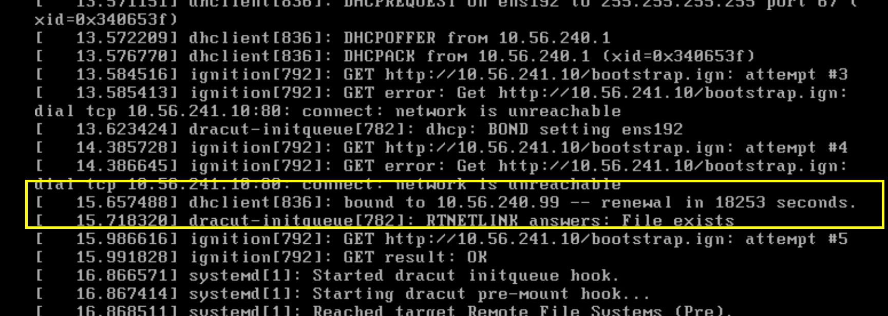
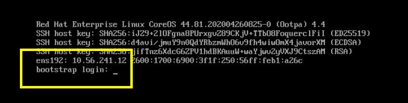
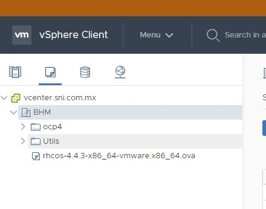
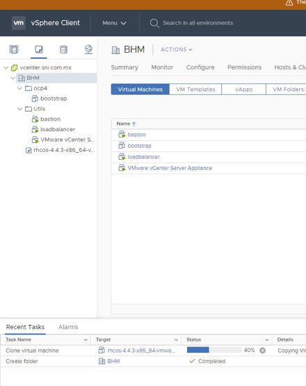
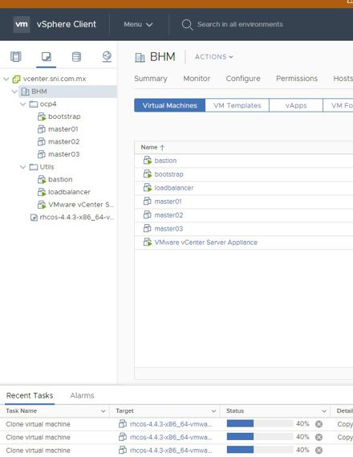
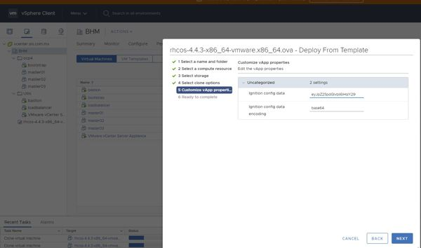

# ocp4-vmware-terraform

The following procedure is intended to create VM's from an **OVA** template booting with **static IP's** when the DHCP server **can not** reserve the IP addresses.

#### The problem
OCP requires that all DNS configurations be in place. VMWare requires that the DHCP assign the correct IPs to the VM. Since many real installations require the coordination with different teams in an organization, many times we don't have control of DNS, DHCP or Loadbalancer configurations.

Sometimes we need to do a **["bare metal"](https://docs.openshift.com/container-platform/4.3/installing/installing_bare_metal/installing-bare-metal.html)** installation over vmware to set the network configuration with kernel parameters at boot (ip, gateway, nameserver, etc.).

#### How does it work?
When the VM boots, it will take the first IP provided by the DHCP server (probably will not be the IP set by the script). ``(...dhclient[836]: bound to 10.56.240.99 -- renewal in 18253 seconds.)``



At the end of the boot process the VM will take the IP provided by the ignition file.



## There are two parts:
1. Create the base64 encoding strings for each VM that includes the network configuration and hostname.
2. Deploy the VM using terraform.

+ #### What do the modified ignition files contain?
Basically the ignition files are a json file; there are 3:
- **bootstrap.ign**: It contains all the cluster configurations to create the OCP cluster.
- **master.ign**: It contains the URL where the master node will pull the configuration, and the certificate to connect with the REST API of OCP.
- **worker.ign**: It contains the same content as the master but pointing to the worker URL.

Example **append-bootstrap.ign** from the [documentation](https://docs.openshift.com/container-platform/4.3/installing/installing_vsphere/installing-vsphere.html#installation-vsphere-machines_installing-vsphere).
```json
{
  "ignition": {
    "config": {
      "append": [
        {
          "source": "http://10.56.241.10/bootstrap.ign",
          "verification": {}
        }
      ]
    },
    "timeouts": {},
    "version": "2.1.0"
  },
  "networkd": {},
  "passwd": {},
  "storage": {},
  "systemd": {}
}
```
Modified **append-bootstrap.ign** injecting network configurations. The Python script injects 2 values in the **storage section** ``/etc/hostname`` and ``/etc/sysconfig/network-scripts/ifcfg-ens192``. In the **networkd** the script creates the unit ``00-ens192.network``. We still need to pull the bootstrap.ign from the webserver (due to the size of the file).
```json
{
  "ignition": {
    "config": {
      "append": [
        {
          "source": "http://10.56.241.10/bootstrap.ign",
          "verification": {}
        }
      ]
    },
    "timeouts": {},
    "version": "2.1.0"
  },
  "networkd": {
    "units": [
      {
        "name": "00-ens192.network",
        "contents": "[Match]\nName=ens192\n\n[Network]\nAddress=.10.56.241.12/23\nGateway=10.56.240.254\nDNS=10.56.240.1\nDomains=example.com\n"
      }
    ]
  },
  "passwd": {},
  "storage": {
    "files": [
      {
        "path": "/etc/hostname",
        "mode": 420,
        "contents": {
          "source": "data:text/plain;charset=utf-8;base64,Ym9vdHN0cmFwLm9jcDQuZXhhbXBsZS5jb20=",
          "verification": {}
        },
        "filesystem": "root"
      },
      {
        "path": "/etc/sysconfig/network-scripts/ifcfg-ens192",
        "mode": 420,
        "contents": {
          "source": "data:text/plain;charset=utf-8;base64,IyBHZW5lcmF0ZWQgYnkgY3JlYXRlX2Jhc2U2NF9maWxlcwpUWVBFPUV0aGVybmV0Ck5BTUU9ImVuczE5MiIKREVWSUNFPSJlbnMxOTIiCk9OQk9PVD15ZXMKTkVUQk9PVD15ZXMKQk9PVFBST1RPPW5vbmUKSVBBRERSPSIxMC41Ni4yNDEuMTIiCk5FVE1BU0s9IjI1NS4yNTUuMjU0LjAiCkdBVEVXQVk9IjEwLjU2LjI0MC4yNTQiCkROUzE9IjEwLjU2LjI0MC4xIgo=",
          "verification": {}
        },
        "filesystem": "root"
      }
    ]
  },
  "systemd": {}
}

```
The Python script does the same for **master.ign** and **worker.ign**.

## Pre-requirements
- Python installed. (I use 3.8.2, I love to use [pyenv](https://github.com/pyenv/pyenv))
- Terraform latest version (v0.12.24) you can download [here](https://www.terraform.io/downloads.html)
- Have the ignitions files already created (master.ign, worker.ign)
- Update the values for your corresponding user, passwords, URL's, etc.

## Procedure
1. The OCP installation dir in my case is ``deploy/``. Run the python script. This will create the file ``terraform/vars/machine_data.tfvars``. We will need this file in the terraform procedure.
```bash
(vmware) alex@:/ocp4-vmware-terraform $ ./create_base64_files
(vmware) alex@:/ocp4-vmware-terraform $
```
2. Modify the file ``terraform/vars/common.tfvars`` with the information of your vmware server. Modify thge file ``terraform/main.tf``with the propper values of your vmware; datacenter, host, network, resource filder, etc.
3. Change to the terraform folder. Unfortunately the terraform provider can't deploy an OVF/OVA template, seems it has a bug. We will use [govc](https://github.com/vmware/govmomi/tree/master/govc) to upload the ova file and create the template.
```bash
(vmware) alex@:/ocp4-vmware-terraform $ cd terraform
alex@:/../terraform $ govc import.ova -dc="datacenter" -ds="datastore1" -pool="sni/Resources" -name="rhcos-4.4.3-x86_64-vmware.x86_64.ova" "https://mirror.openshift.com/pub/openshift-v4/dependencies/rhcos/latest/latest/rhcos-4.4.3-x86_64-vmware.x86_64.ova"
alex@:/../terraform $ govc snapshot.create -dc="datacenter" -vm="rhcos-4.4.3-x86_64-vmware.x86_64.ova" clone-root
alex@:/../terraform $ govc vm.markastemplate -dc="datacenter" "rhcos-4.4.3-x86_64-vmware.x86_64.ova"
```


4. Create a plan in terraform. I divided it into 4 modules: bootstrap, master, worker and infra. We can create a plan to create 8 VM's (3 masters, 2 workers, 2 infras, and the bootstrap); but I recommend creating one plan at time, starting with the bootstrap.
```bash
alex@:/../terraform $ ./plan -target=module.bootstrap
Initializing modules...
Initializing the backend...
Initializing provider plugins...
An execution plan has been generated and is shown below.
Resource actions are indicated with the following symbols:
  + create
 <= read (data resources)
Terraform will perform the following actions:
....
Plan: 2 to add, 0 to change, 0 to destroy.
.
Warning: Resource targeting is in effect
.
You are creating a plan with the -target option, which means that the result
of this plan may not represent all of the changes requested by the current
configuration.
.
The -target option is not for routine use, and is provided only for
exceptional situations such as recovering from errors or mistakes, or when
Terraform specifically suggests to use it as part of an error message.
.
.
This plan was saved to: /mnt/z/Work/RedHat/ocp4-vmware-terraform/terraform/outputs/tf.output
.
To perform exactly these actions, run the following command to apply:
    terraform apply "/mnt/z/Work/RedHat/ocp4-vmware-terraform/terraform/outputs/tf.output"
.
.
```
5. Apply the plan created.
```bash
alex@:/../terraform $ ./apply
Initializing modules...
Initializing the backend...
Initializing provider plugins...
.
.
.
data.vsphere_datacenter.dc: Refreshing state...
data.vsphere_datastore.datastore: Refreshing state...
data.vsphere_resource_pool.sni: Refreshing state...
data.vsphere_virtual_machine.rhcos_template: Refreshing state...
data.vsphere_network.network: Refreshing state...
data.vsphere_host.esxi67: Refreshing state...
vsphere_folder.cluster: Creating...
vsphere_folder.cluster: Creation complete after 1s [id=group-v185]
module.bootstrap.vsphere_virtual_machine.clone[0]: Creating...
module.bootstrap.vsphere_virtual_machine.clone[0]: Still creating... [10s elapsed]
module.bootstrap.vsphere_virtual_machine.clone[0]: Still creating... [20s elapsed]
module.bootstrap.vsphere_virtual_machine.clone[0]: Still creating... [30s elapsed]
module.bootstrap.vsphere_virtual_machine.clone[0]: Still creating... [40s elapsed]
module.bootstrap.vsphere_virtual_machine.clone[0]: Still creating... [50s elapsed]
module.bootstrap.vsphere_virtual_machine.clone[0]: Still creating... [1m0s elapsed]
.
.
.
module.bootstrap.vsphere_virtual_machine.clone[0]: Still creating... [3m10s elapsed]
module.bootstrap.vsphere_virtual_machine.clone[0]: Still creating... [3m20s elapsed]
module.bootstrap.vsphere_virtual_machine.clone[0]: Creation complete after 3m23s [id=423147d7-b7ff-11d2-1762-a2e10dd37584]
.
Warning: Applied changes may be incomplete
.
The plan was created with the -target option in effect, so some changes
requested in the configuration may have been ignored and the output values may
not be fully updated. Run the following command to verify that no other
changes are pending:
    terraform plan
.
Note that the -target option is not suitable for routine use, and is provided
only for exceptional situations such as recovering from errors or mistakes, or
when Terraform specifically suggests to use it as part of an error message.
.
Apply complete! Resources: 2 added, 0 changed, 0 destroyed.
.
The state of your infrastructure has been saved to the path
below. This state is required to modify and destroy your
infrastructure, so keep it safe. To inspect the complete state
use the `terraform show` command.
.
State path: terraform.tfstate
```
The output above shows 2 resources added, 1 is the folder ``ocp4`` and the 2nd is the VM bootstrap.


6. Repeat the the plan/apply for the masters, workers and infra (in case that you have).
```bash
alex@:/../terraform $ ./plan -target=module.master
.
Plan: 3 to add, 0 to change, 0 to destroy.
.
alex@:/../terraform $ ./apply
.
.
If you ever set or change modules or backend configuration for Terraform,
rerun this command to reinitialize your working directory. If you forget, other
commands will detect it and remind you to do so if necessary.
module.master.vsphere_virtual_machine.clone[2]: Creating...
module.master.vsphere_virtual_machine.clone[0]: Creating...
module.master.vsphere_virtual_machine.clone[1]: Creating...
.
.
.
alex@:/../terraform $ ./plan -target=module.worker
.
alex@:/../terraform $ ./apply
.
.
.
alex@:/../terraform $ ./plan -target=module.infra
.
alex@:/../terraform $ ./apply
.
.
```


#### Working manually with vmware
If you want to create the VM machines manually you can copy/paste the base64 strings to the manual procedure in vmware. Go to ``terraform/vars/machine_data.tfvars`` you can see the values for each server in base64 encoding.



#### Destroy
You can easily destroy the bootstrap once you don't need it anymore.
```bash
alex@:/../terraform $ ./destroy --target=module.bootstrap
data.vsphere_datacenter.dc: Refreshing state...
data.vsphere_host.esxi67: Refreshing state...
Plan: 0 to add, 0 to change, 1 to destroy.
.
Warning: Resource targeting is in effect
.
Do you really want to destroy all resources?
  Terraform will destroy all your managed infrastructure, as shown above.
  There is no undo. Only 'yes' will be accepted to confirm.
.
  Enter a value: yes
.  
module.bootstrap.vsphere_virtual_machine.clone[0]: Destroying... [id=423147d7-b7ff-11d2-1762-a2e10dd37584]
module.bootstrap.vsphere_virtual_machine.clone[0]: Destruction complete after 9s
.
Destroy complete! Resources: 1 destroyed.
```
Or you can destroy everything
```bash
alex@:/../terraform $ ./destroy
Plan: 0 to add, 0 to change, 4 to destroy.
.
Do you really want to destroy all resources?
  Terraform will destroy all your managed infrastructure, as shown above.
  There is no undo. Only 'yes' will be accepted to confirm.
.
  Enter a value: yes
  module.master.vsphere_virtual_machine.clone[1]: Destroying... [id=4231f92a-08c9-6afe-7f0c-b17105e7991a]
  module.master.vsphere_virtual_machine.clone[0]: Destroying... [id=4231da99-3018-40dd-2532-157990aea86f]
  module.master.vsphere_virtual_machine.clone[2]: Destroying... [id=423188fc-571c-f243-367c-c6edaf8906b2]
  module.master.vsphere_virtual_machine.clone[2]: Destruction complete after 4s
  module.master.vsphere_virtual_machine.clone[1]: Destruction complete after 4s
  module.master.vsphere_virtual_machine.clone[0]: Destruction complete after 5s
  vsphere_folder.cluster: Destroying... [id=group-v185]
  vsphere_folder.cluster: Destruction complete after 0s
.  
  Destroy complete! Resources: 4 destroyed.
```

References
- https://docs.openshift.com/container-platform/4.3/installing/installing_vsphere/installing-vsphere.html
- https://docs.openshift.com/container-platform/4.3/installing/installing_bare_metal/installing-bare-metal.html
- https://github.com/pyenv/pyenv
- https://www.terraform.io/
- https://github.com/terraform-providers/terraform-provider-vsphere
- https://github.com/vmware/govmomi/tree/master/govc
